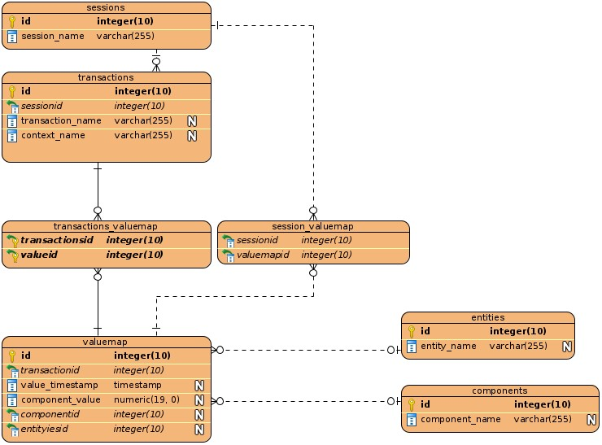

# Database Documentation

## Structure




## SQL Queries

1. Get all sessions
```
??
```

2. Get static session data like customer and Status data
```
??
```

3. Get all transactions mapped to a specific session
```
??
```

4. Get all data mapped to one transaction
```
??
```

5. Get entity component relationship map
```
??
```


We recommend to use sqllite browser available [here](https://sqlitebrowser.org/)

## Elements


| Entity              | Component              | Meaning             | Unit           | Format |
|---------------------|------------------------|---------------------|----------------|--------|
| Burden1Module1      | ACT_Burden1            |                     |                |        |
| Burden1Module1      | ACT_Burden2            |                     |                |        |
| Burden1Module1      | ACT_Burden3            |                     |                |        |
| Burden1Module1      | ACT_PFactor1           |                     |                |        |
| Burden1Module1      | ACT_PFactor2           |                     |                |        |
| Burden1Module1      | ACT_PFactor3           |                     |                |        |
| Burden1Module1      | ACT_Ratio1             |                     |                |        |
| Burden1Module1      | ACT_Ratio2             |                     |                |        |
| Burden1Module1      | ACT_Ratio3             |                     |                |        |
| Burden1Module1      | PAR_NominalBurden      |                     |                |        |
| Burden1Module1      | PAR_NominalRange       |                     |                |        |
| Burden1Module1      | PAR_NominalRangeFactor |                     |                |        |
| Burden1Module1      | PAR_WCrosssection      |                     |                |        |
| Burden1Module1      | PAR_WireLength         |                     |                |        |
| Burden1Module1      | SIG_Measuring          |                     |                |        |
| Burden1Module2      | ACT_Burden1            | Sb U L1             |                |        |
| Burden1Module2      | ACT_Burden2            | Sb U L2             |                |        |
| Burden1Module2      | ACT_Burden3            | Sb U L3             |                |        |
| Burden1Module2      | ACT_PFactor1           | cos(&beta;) U L1    |                |        |
| Burden1Module2      | ACT_PFactor2           | cos(&beta;) U L2    |                |        |
| Burden1Module2      | ACT_PFactor3           | cos(&beta;) U L3    |                |        |
| Burden1Module2      | ACT_Ratio1             | Sn U L1             |                |        |
| Burden1Module2      | ACT_Ratio2             | Sn U L2             |                |        |
| Burden1Module2      | ACT_Ratio3             | Sn U L3             |                |        |
| Burden1Module2      | PAR_NominalBurden      | Nominal Burden      |                |        |
| Burden1Module2      | PAR_NominalRange       | Nominal Range       |                |        |
| Burden1Module2      | PAR_NominalRangeFactor |                     |                |        |
| Burden1Module2      | PAR_WCrosssection      | Wire cross Section  | mm<sup>2</sup> |        |
| Burden1Module2      | PAR_WireLength         |                     |                |        |
| Burden1Module2      | SIG_Measuring          |                     |                |        |
| CustomerData        | FileSelected           |                     |                |        |
| CustomerData        | PAR_CustomerCity       |                     |                |        |
| CustomerData        | PAR_CustomerComment    |                     |                |        |
| CustomerData        | PAR_CustomerCountry    |                     |                |        |
| CustomerData        | PAR_CustomerFirstName  |                     |                |        |
| CustomerData        | PAR_CustomerLastName   |                     |                |        |
| CustomerData        | PAR_CustomerNumber     |                     |                |        |
| CustomerData        | PAR_CustomerPostalCode |                     |                |        |
| CustomerData        | PAR_CustomerStreet     |                     |                |        |
| CustomerData        | PAR_DatasetComment     |                     |                |        |
| CustomerData        | PAR_DatasetIdentifier  |                     |                |        |
| CustomerData        | PAR_LocationCity       |                     |                |        |
| CustomerData        | PAR_LocationComment    |                     |                |        |
| CustomerData        | PAR_LocationCountry    |                     |                |        |
| CustomerData        | PAR_LocationFirstName  |                     |                |        |
| CustomerData        | PAR_LocationLastName   |                     |                |        |
| CustomerData        | PAR_LocationNumber     |                     |                |        |
| CustomerData        | PAR_LocationPostalCode |                     |                |        |
| CustomerData        | PAR_LocationStreet     |                     |                |        |
| CustomerData        | PAR_MeterComment       |                     |                |        |
| CustomerData        | PAR_MeterFactoryNumber |                     |                |        |
| CustomerData        | PAR_MeterManufacturer  |                     |                |        |
| CustomerData        | PAR_MeterOwner         |                     |                |        |
| CustomerData        | PAR_PowerGridComment   |                     |                |        |
| CustomerData        | PAR_PowerGridOperator  |                     |                |        |
| CustomerData        | PAR_PowerGridSupplier  |                     |                |        |
| DFTModule1          | ACT_DFTPN1             | U1                  |                |        |
| DFTModule1          | ACT_DFTPN2             | U2                  |                |        |
| DFTModule1          | ACT_DFTPN3             | U3                  |                |        |
| DFTModule1          | ACT_DFTPN4             | I1                  |                |        |
| DFTModule1          | ACT_DFTPN5             | I2                  |                |        |
| DFTModule1          | ACT_DFTPN6             | I3                  |                |        |
| DFTModule1          | ACT_DFTPN7             |                     |                |        |
| DFTModule1          | ACT_DFTPN8             |                     |                |        |
| DFTModule1          | ACT_DFTPP1             |                     |                |        |
| DFTModule1          | ACT_DFTPP2             |                     |                |        |
| DFTModule1          | ACT_DFTPP3             |                     |                |        |
| DFTModule1          | ACT_RFIELD             |                     |                |        |
| DFTModule1          | PAR_Interval           |                     |                |        |
| DFTModule1          | PAR_RefChannel         |                     |                |        |
| DFTModule1          | SIG_Measuring          |                     |                |        |
| DFTModule1          | SIG_Measuring          |                     |                |        |
| FFTModule1          | ACT_FFT1               | U1 Harmonics 0-40   |                |        |
| FFTModule1          | ACT_FFT2               | U2 Harmonics 0-40   |                |        |
| FFTModule1          | ACT_FFT3               | U3 Harmonics 0-40   |                |        |
| FFTModule1          | ACT_FFT4               |                     |                |        |
| FFTModule1          | ACT_FFT5               | I1 Harmonics 0-40   |                |        |
| FFTModule1          | ACT_FFT6               | I2 Harmonics 0-40   |                |        |
| FFTModule1          | ACT_FFT7               | I3 Harmonics 0-40   |                |        |
| FFTModule1          | ACT_FFT8               |                     |                |        |
| FFTModule1          | PAR_Interval           |                     |                |        |
| FFTModule1          | PAR_RefChannel         |                     |                |        |
| FFTModule1          | SIG_Measuring          |                     |                |        |
| LambdaModule1       | ACT_Lambda1            | Lambda L1           |                |        |
| LambdaModule1       | ACT_Lambda2            | Lambda L2           |                |        |
| LambdaModule1       | ACT_Lambda3            | Lambda L3           |                |        |
| LambdaModule1       | ACT_Lambda4            |                     |                |        |
| LambdaModule1       | SIG_Measuring          |                     |                |        |
| OSCIModule1         | ACT_OSCI1              | U1 Curve            |                |        |
| OSCIModule1         | ACT_OSCI2              | U2 Curve            |                |        |
| OSCIModule1         | ACT_OSCI3              | U3 Curve            |                |        |
| OSCIModule1         | ACT_OSCI4              |                     |                |        |
| OSCIModule1         | ACT_OSCI5              | I1 Curve            |                |        |
| OSCIModule1         | ACT_OSCI6              | I2 Curve            |                |        |
| OSCIModule1         | ACT_OSCI7              | I3 Curve            |                |        |
| OSCIModule1         | ACT_OSCI8              |                     |                |        |
| OSCIModule1         | PAR_RefChannel         |                     |                |        |
| OSCIModule1         | SIG_Measuring          |                     |                |        |
| POWER1Module1       | ACT_PQS1               | P L1                |                |        |
| POWER1Module1       | ACT_PQS2               | P L2                |                |        |
| POWER1Module1       | ACT_PQS3               | P L3                |                |        |
| POWER1Module1       | ACT_PQS4               |                     |                |        |
| POWER1Module1       | PAR_FOUTConstant0      |                     |                |        |
| POWER1Module1       | PAR_Interval           |                     |                |        |
| POWER1Module1       | PAR_MeasuringMode      |                     |                |        |
| POWER1Module1       | SIG_Measuring          |                     |                |        |
| POWER1Module1       | SIG_Measuring          |                     |                |        |
| POWER1Module2       | ACT_PQS1               | Q L1                |                |        |
| POWER1Module2       | ACT_PQS2               | Q L2                |                |        |
| POWER1Module2       | ACT_PQS3               | Q L3                |                |        |
| POWER1Module2       | ACT_PQS4               |                     |                |        |
| POWER1Module2       | PAR_FOUTConstant0      |                     |                |        |
| POWER1Module2       | PAR_Interval           |                     |                |        |
| POWER1Module2       | PAR_MeasuringMode      |                     |                |        |
| POWER1Module2       | SIG_Measuring          |                     |                |        |
| POWER1Module2       | SIG_Measuring          |                     |                |        |
| POWER1Module3       | ACT_PQS1               | S L1                |                |        |
| POWER1Module3       | ACT_PQS2               | S L2                |                |        |
| POWER1Module3       | ACT_PQS3               | S L3                |                |        |
| POWER1Module3       | ACT_PQS4               |                     |                |        |
| POWER1Module3       | PAR_FOUTConstant0      |                     |                |        |
| POWER1Module3       | PAR_Interval           |                     |                |        |
| POWER1Module3       | PAR_MeasuringMode      |                     |                |        |
| POWER1Module3       | SIG_Measuring          |                     |                |        |
| POWER1Module3       | SIG_Measuring          |                     |                |        |
| RangeModule1        | ACT_Channel1Peak       |                     |                |        |
| RangeModule1        | ACT_Channel1Peak       |                     |                |        |
| RangeModule1        | ACT_Channel2Peak       |                     |                |        |
| RangeModule1        | ACT_Channel2Peak       |                     |                |        |
| RangeModule1        | ACT_Channel3Peak       |                     |                |        |
| RangeModule1        | ACT_Channel3Peak       |                     |                |        |
| RangeModule1        | ACT_Channel4Peak       |                     |                |        |
| RangeModule1        | ACT_Channel4Peak       |                     |                |        |
| RangeModule1        | ACT_Channel5Peak       |                     |                |        |
| RangeModule1        | ACT_Channel5Peak       |                     |                |        |
| RangeModule1        | ACT_Channel6Peak       |                     |                |        |
| RangeModule1        | ACT_Channel6Peak       |                     |                |        |
| RangeModule1        | ACT_Channel7Peak       |                     |                |        |
| RangeModule1        | ACT_Channel7Peak       |                     |                |        |
| RangeModule1        | ACT_Channel8Peak       |                     |                |        |
| RangeModule1        | ACT_Channel8Peak       |                     |                |        |
| RangeModule1        | ACT_Frequency          |                     |                |        |
| RangeModule1        | ACT_Frequency          |                     |                |        |
| RangeModule1        | INF_Adjusted           |                     |                |        |
| RangeModule1        | INF_Channel1ActOVLREJ  |                     |                |        |
| RangeModule1        | INF_Channel1ActREJ     |                     |                |        |
| RangeModule1        | INF_Channel1OVLREJ     |                     |                |        |
| RangeModule1        | INF_Channel2ActOVLREJ  |                     |                |        |
| RangeModule1        | INF_Channel2ActREJ     |                     |                |        |
| RangeModule1        | INF_Channel2OVLREJ     |                     |                |        |
| RangeModule1        | INF_Channel3ActOVLREJ  |                     |                |        |
| RangeModule1        | INF_Channel3ActREJ     |                     |                |        |
| RangeModule1        | INF_Channel3OVLREJ     |                     |                |        |
| RangeModule1        | INF_Channel4ActOVLREJ  |                     |                |        |
| RangeModule1        | INF_Channel4ActREJ     |                     |                |        |
| RangeModule1        | INF_Channel4OVLREJ     |                     |                |        |
| RangeModule1        | INF_Channel5ActOVLREJ  |                     |                |        |
| RangeModule1        | INF_Channel5ActREJ     |                     |                |        |
| RangeModule1        | INF_Channel5OVLREJ     |                     |                |        |
| RangeModule1        | INF_Channel6ActOVLREJ  |                     |                |        |
| RangeModule1        | INF_Channel6ActREJ     |                     |                |        |
| RangeModule1        | INF_Channel6OVLREJ     |                     |                |        |
| RangeModule1        | INF_Channel7ActOVLREJ  |                     |                |        |
| RangeModule1        | INF_Channel7ActREJ     |                     |                |        |
| RangeModule1        | INF_Channel7OVLREJ     |                     |                |        |
| RangeModule1        | INF_Channel8ActOVLREJ  |                     |                |        |
| RangeModule1        | INF_Channel8ActREJ     |                     |                |        |
| RangeModule1        | INF_Channel8OVLREJ     |                     |                |        |
| RangeModule1        | INF_OverloadMax        |                     |                |        |
| RangeModule1        | INF_OverloadMax        |                     |                |        |
| RangeModule1        | PAR_Channel1Range      |                     |                |        |
| RangeModule1        | PAR_Channel2Range      |                     |                |        |
| RangeModule1        | PAR_Channel3Range      |                     |                |        |
| RangeModule1        | PAR_Channel4Range      |                     |                |        |
| RangeModule1        | PAR_Channel5Range      |                     |                |        |
| RangeModule1        | PAR_Channel6Range      |                     |                |        |
| RangeModule1        | PAR_Channel7Range      |                     |                |        |
| RangeModule1        | PAR_Channel8Range      |                     |                |        |
| RangeModule1        | PAR_ChannelGrouping    |                     |                |        |
| RangeModule1        | PAR_Overload           |                     |                |        |
| RangeModule1        | PAR_Overload           |                     |                |        |
| RangeModule1        | PAR_RangeAutomatic     |                     |                |        |
| RangeModule1        | SIG_Channel1OVL        |                     |                |        |
| RangeModule1        | SIG_Channel1OVL        |                     |                |        |
| RangeModule1        | SIG_Channel2OVL        |                     |                |        |
| RangeModule1        | SIG_Channel2OVL        |                     |                |        |
| RangeModule1        | SIG_Channel3OVL        |                     |                |        |
| RangeModule1        | SIG_Channel3OVL        |                     |                |        |
| RangeModule1        | SIG_Channel4OVL        |                     |                |        |
| RangeModule1        | SIG_Channel4OVL        |                     |                |        |
| RangeModule1        | SIG_Channel5OVL        |                     |                |        |
| RangeModule1        | SIG_Channel5OVL        |                     |                |        |
| RangeModule1        | SIG_Channel6OVL        |                     |                |        |
| RangeModule1        | SIG_Channel6OVL        |                     |                |        |
| RangeModule1        | SIG_Channel7OVL        |                     |                |        |
| RangeModule1        | SIG_Channel7OVL        |                     |                |        |
| RangeModule1        | SIG_Channel8OVL        |                     |                |        |
| RangeModule1        | SIG_Channel8OVL        |                     |                |        |
| RangeModule1        | SIG_Measuring          |                     |                |        |
| RangeModule1        | SIG_Measuring          |                     |                |        |
| RangeModule1        | SIG_Measuring          |                     |                |        |
| RangeModule1        | SIG_Ranging            |                     |                |        |
| RMSModule1          | ACT_RMSPN1             | UPN L1              |                |        |
| RMSModule1          | ACT_RMSPN2             | UPN L2              |                |        |
| RMSModule1          | ACT_RMSPN3             | UPN L3              |                |        |
| RMSModule1          | ACT_RMSPN4             | I L1                |                |        |
| RMSModule1          | ACT_RMSPN5             | I L2                |                |        |
| RMSModule1          | ACT_RMSPN6             | I lL3               |                |        |
| RMSModule1          | ACT_RMSPN7             |                     |                |        |
| RMSModule1          | ACT_RMSPN8             |                     |                |        |
| RMSModule1          | ACT_RMSPP1             | UPP L12             |                |        |
| RMSModule1          | ACT_RMSPP2             | UPP L23             |                |        |
| RMSModule1          | ACT_RMSPP3             | UPP L31             |                |        |
| RMSModule1          | PAR_Interval           |                     |                |        |
| RMSModule1          | SIG_Measuring          |                     |                |        |
| RMSModule1          | SIG_Measuring          |                     |                |        |
| SEC1Module1         | ACT_Energy             |                     |                |        |
| SEC1Module1         | ACT_EnergyFinal        |                     |                |        |
| SEC1Module1         | ACT_Progress           |                     |                |        |
| SEC1Module1         | ACT_Rating             |                     |                |        |
| SEC1Module1         | ACT_Result             |                     |                |        |
| SEC1Module1         | ACT_Status             |                     |                |        |
| SEC1Module1         | PAR_Continuous         |                     |                |        |
| SEC1Module1         | PAR_DutConstant        |                     |                |        |
| SEC1Module1         | PAR_DUTConstUnit       |                     |                |        |
| SEC1Module1         | PAR_DutInput           |                     |                |        |
| SEC1Module1         | PAR_Energy             |                     |                |        |
| SEC1Module1         | PAR_Lolimit            |                     |                |        |
| SEC1Module1         | PAR_Mode               |                     |                |        |
| SEC1Module1         | PAR_MRate              |                     |                |        |
| SEC1Module1         | PAR_RefConstant        |                     |                |        |
| SEC1Module1         | PAR_RefInput           |                     |                |        |
| SEC1Module1         | PAR_StartStop          |                     |                |        |
| SEC1Module1         | PAR_Target             |                     |                |        |
| SEC1Module1         | PAR_Uplimit            |                     |                |        |
| SEM1Module1         | ACT_Energy             |                     |                |        |
| SEM1Module1         | ACT_Power              |                     |                |        |
| SEM1Module1         | ACT_Rating             |                     |                |        |
| SEM1Module1         | ACT_Result             |                     |                |        |
| SEM1Module1         | ACT_Status             |                     |                |        |
| SEM1Module1         | ACT_Time               |                     |                |        |
| SEM1Module1         | PAR_Lolimit            |                     |                |        |
| SEM1Module1         | PAR_MeasTime           |                     |                |        |
| SEM1Module1         | PAR_RefConstant        |                     |                |        |
| SEM1Module1         | PAR_RefInput           |                     |                |        |
| SEM1Module1         | PAR_StartStop          |                     |                |        |
| SEM1Module1         | PAR_T0Input            |                     |                |        |
| SEM1Module1         | PAR_T1input            |                     |                |        |
| SEM1Module1         | PAR_Targeted           |                     |                |        |
| SEM1Module1         | PAR_TXUNIT             |                     |                |        |
| SEM1Module1         | PAR_Uplimit            |                     |                |        |
| SPM1Module1         | ACT_Energy             |                     |                |        |
| SPM1Module1         | ACT_Power              |                     |                |        |
| SPM1Module1         | ACT_Rating             |                     |                |        |
| SPM1Module1         | ACT_Result             |                     |                |        |
| SPM1Module1         | ACT_Status             |                     |                |        |
| SPM1Module1         | ACT_Time               |                     |                |        |
| SPM1Module1         | PAR_Lolimit            |                     |                |        |
| SPM1Module1         | PAR_MeasTime           |                     |                |        |
| SPM1Module1         | PAR_RefConstant        |                     |                |        |
| SPM1Module1         | PAR_RefInput           |                     |                |        |
| SPM1Module1         | PAR_StartStop          |                     |                |        |
| SPM1Module1         | PAR_T0Input            |                     |                |        |
| SPM1Module1         | PAR_T1input            |                     |                |        |
| SPM1Module1         | PAR_Targeted           |                     |                |        |
| SPM1Module1         | PAR_TXUNIT             |                     |                |        |
| SPM1Module1         | PAR_Uplimit            |                     |                |        |
| StatusModule1       | INF_AdjChksum          |                     |                |        |
| StatusModule1       | INF_Adjusted           |                     |                |        |
| StatusModule1       | INF_CTRLVersion        |                     |                |        |
| StatusModule1       | INF_DeviceType         |                     |                |        |
| StatusModule1       | INF_DSPServerVersion   |                     |                |        |
| StatusModule1       | INF_DSPVersion         |                     |                |        |
| StatusModule1       | INF_FPGAVersion        |                     |                |        |
| StatusModule1       | INF_PCBServerVersion   |                     |                |        |
| StatusModule1       | INF_ReleaseNr          |                     |                |        |
| StatusModule1       | PAR_SerialNr           |                     |                |        |
| THDNModule1         | ACT_THDN1              |                     |                |        |
| THDNModule1         | ACT_THDN2              |                     |                |        |
| THDNModule1         | ACT_THDN3              |                     |                |        |
| THDNModule1         | ACT_THDN4              |                     |                |        |
| THDNModule1         | ACT_THDN5              |                     |                |        |
| THDNModule1         | ACT_THDN6              |                     |                |        |
| THDNModule1         | ACT_THDN7              |                     |                |        |
| THDNModule1         | ACT_THDN8              |                     |                |        |
| THDNModule1         | PAR_Interval           |                     |                |        |
| THDNModule1         | SIG_Measuring          |                     |                |        |
| THDNModule1         | SIG_Measuring          |                     |                |        |
| THDNModule2         | ACT_THDR1              |                     |                |        |
| THDNModule2         | ACT_THDR2              |                     |                |        |
| THDNModule2         | ACT_THDR3              |                     |                |        |
| THDNModule2         | ACT_THDR4              |                     |                |        |
| THDNModule2         | ACT_THDR5              |                     |                |        |
| THDNModule2         | ACT_THDR6              |                     |                |        |
| THDNModule2         | ACT_THDR7              |                     |                |        |
| THDNModule2         | ACT_THDR8              |                     |                |        |
| THDNModule2         | PAR_Interval           |                     |                |        |
| THDNModule2         | SIG_Measuring          |                     |                |        |
| THDNModule2         | SIG_Measuring          |                     |                |        |
| Transformer1Module1 | ACT_Angle1             |                     |                |        |
| Transformer1Module1 | ACT_Error1             |                     |                |        |
| Transformer1Module1 | ACT_INSecondary1       |                     |                |        |
| Transformer1Module1 | ACT_IXPrimary1         |                     |                |        |
| Transformer1Module1 | ACT_IXSecondary1       |                     |                |        |
| Transformer1Module1 | ACT_Ratio1             |                     |                |        |
| Transformer1Module1 | PAR_DutPrimary         |                     |                |        |
| Transformer1Module1 | PAR_DutSecondary       |                     |                |        |
| Transformer1Module1 | PAR_PrimClampPrim      |                     |                |        |
| Transformer1Module1 | PAR_PrimClampSec       |                     |                |        |
| Transformer1Module1 | PAR_SecClampPrim       |                     |                |        |
| Transformer1Module1 | PAR_SecClampSec        |                     |                |        |
| Transformer1Module1 | SIG_Measuring          |                     |                |        |