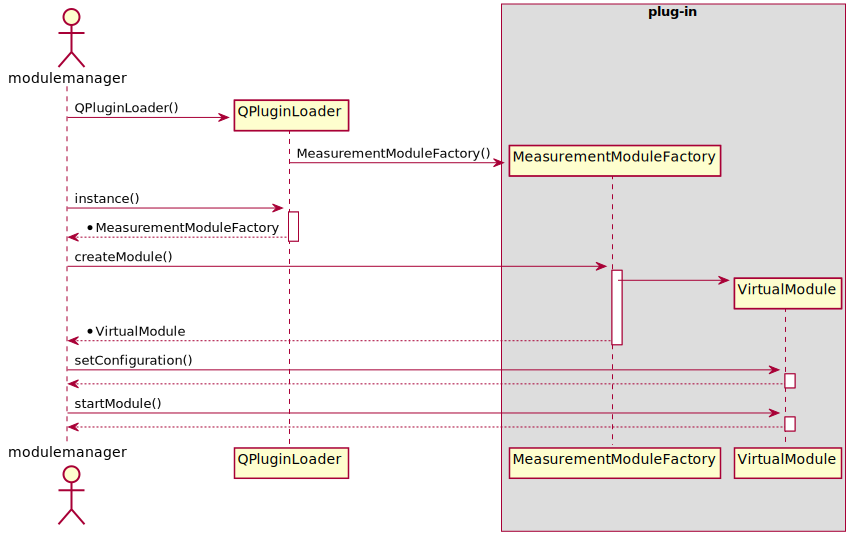

<div style="text-align: right"> 10.12.2020 </div>

# Zera Module-manager

The zera modulemanager is vein broker as well as manager for all 
vein plug-ins. All plug-ins located in the plug-in path will be loaded.
Only plug-in listed in the configuration file will get created. 
The module manager will add the created plug-ins vein interface to the brokers EventHandler.

## Configuration

The Configuration file is a json file. The default path where they have to be located is 
/etc/zera/modules. It is possible to change this path inside the CMakeLists.txt file though.

Each file has to have a unique name and be of the following structure:

```json
{
    "modules" : [
      {
        "name" : "<modulename>",
        "configPath" : "<moduleConfigurationFilePath>",
        "id": "<moduleId>"
      },
      ...
      {
      ...    
      }
    ]

```

The name is the plug-ins name. The actual file has the name lib<modulename>.so. The plug-in should be located in lib/zera-modules/.
Furthermore, all modules can have some kind of configuration. The configuration file can be of any type. 
The Modulemanager will only transmit the path. The id is the vein entity id. The entity id has to be unique in the complete system configuration. That means, that each plug-in must have exactly one VeinEvent::EventSystem object.

Its possible to add as many modules as you want. The only limitation is the available CPU performance.


## How the vein message broker works

The vein message broker is not much different from any other vein node. It connects several vein subsystems
to the VeinEvent::EventHandler. The main difference is that the most important systems are VeinNet::NetworkSystem and VeinNet::TcpSystem. VeinNet::TcpSystem starts a TCP server and forwards all incoming messages to the VeinEvent::EventHandler. Furthermore the broker owns the VeinEvent::StorageSystem module. The StorageSystem provides a up to date memory image of all components.  

<!-- <div hidden>
@startuml VeinBrokerBasic


@enduml
</div>

 -->


## Loading Plugins

Each plug-in is created with a specified interface described in chapter Plug-in Interface.
The createFunction returns a VirtualModule object. VirtualModule is a interface as well and serves as abstraction for the measurementModule functions. For example the startModule() function starts the modules execution. It has to triggers the init state of a QStateMachine.
The following sequence shows an fundamental overview.

<div hidden>
@startuml modPlugSeq

actor modulemanager
participant QPluginLoader
box plug-in
participant MeasurementModuleFactory 
participant VirtualModule
end box

modulemanager -> QPluginLoader **: QPluginLoader()
QPluginLoader -> MeasurementModuleFactory ** : MeasurementModuleFactory()
modulemanager -> QPluginLoader : instance()
activate QPluginLoader
return *MeasurementModuleFactory
deactivate QPluginLoader
modulemanager -> MeasurementModuleFactory : createModule()
activate MeasurementModuleFactory
MeasurementModuleFactory -> VirtualModule **
return *VirtualModule
deactivate MeasurementModuleFactory
modulemanager -> VirtualModule : setConfiguration()
activate VirtualModule
return 
modulemanager -> VirtualModule : startModule()
activate VirtualModule
return 

@enduml
</div>




### Plug-in Interface


The modulemanager uses the qt plug-in low level API. You can find a detailed description in chapter *The Low-Level API: Extending Qt Applications* [here](https://doc.qt.io/qt-5/plugins-howto.html).
The following documentation expects you to know the basics described in the Qt documentation.
 
The modulemanager uses the *MeasurementModuleFactory* class as interface. 

```cpp
class MeasurementModuleFactory
{
public:
  virtual ~MeasurementModuleFactory() {}
  virtual ZeraModules::VirtualModule *createModule(Zera::Proxy::cProxy* proxy, int entityId, VeinEvent::StorageSystem* storagesystem, QObject* qObjParent = 0)=0;

  virtual void destroyModule(ZeraModules::VirtualModule *module)=0;
  virtual QList<ZeraModules::VirtualModule*> listModules() const =0;
  virtual QString getFactoryName() const =0;
};

#define MeasurementModuleFactory_iid "org.qt-project.Qt.Examples.Test/1.0"
Q_DECLARE_INTERFACE(MeasurementModuleFactory, MeasurementModuleFactory_iid)
```

The Actual Interface has to use the Q_OBJECT macro as all classes inheriting from QObject have to.
The Q_Interface() macro imforms the QPluginLoader which interface to use.
THe Q_PLUGIN_METADATA() macro exports the plug-in.

```cpp
class plugInInterface : public QObject, public MeasurementModuleFactory
{
    Q_OBJECT
    Q_PLUGIN_METADATA(IID MeasurementModuleFactory_iid)
    Q_INTERFACES(InterfaceClass)
  
public:
    DftModuleFactory(){}
    ZeraModules::VirtualModule *createModule(Zera::Proxy::cProxy* proxy, int entityId, VeinEvent::StorageSystem* storagesystem, QObject* parent = 0);
    void destroyModule(ZeraModules::VirtualModule *module); //override;
    QList<ZeraModules::VirtualModule *> listModules() const; //override;
    QString getFactoryName() const; //override;

private:
  QList<ZeraModules::VirtualModule*> m_ModuleList; // our list of modules
};
```

### Module Interface


```cpp
class VirtualModule : public QObject
  {
    Q_OBJECT
  public:
    explicit VirtualModule(QObject *qObjParent=0) : QObject(qObjParent) {}
    virtual ~VirtualModule() {}
    virtual QList<const QState*> getActualStates() const =0; // in case parallel working states
    virtual void setConfiguration(QByteArray xmlConfigData)=0; // here we set configuration and parameters
    virtual QByteArray getConfiguration() const =0;
    virtual bool isConfigured() const =0;

    virtual void startModule()=0;
    virtual void stopModule()=0;

    QStateMachine m_ActivationMachine; // we use statemachine for module activation
    QStateMachine m_DeactivationMachine; // and deactivation

  signals:
    // signals to be used by activation and deactivation statemachine when ready
    void activationReady();
    void deactivationReady();

    // signals for modulemanager notification
    void moduleError(QString errorString);
    void moduleActivated();
    void moduleDeactivated();
    void addEventSystem(VeinEvent::EventSystem*);
    void parameterChanged();

  protected:
    QStateMachine *m_pStateMachine;

    QState *m_pStateIdle;
    QState *m_pStateConfigure;
    QState *m_pStateRun;
    QState *m_pStateStop;
    QFinalState *m_pStateFinished;
  };
```


