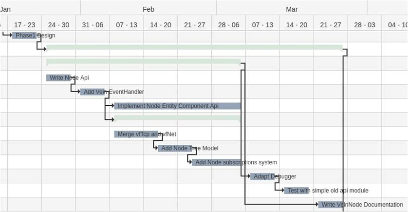

<script type="text/javascript" async
  src="https://cdn.mathjax.org/mathjax/latest/MathJax.js?config=TeX-MML-AM_CHTML">
</script>

<div style="text-align: right"> 10.12.2020 </div>
# New Vein Design

## Index

- [New Vein Design](#new-vein-design)
  - [Index](#index)
  - [Introduction](#introduction)
- [Design Goals](#design-goals)
  - [The Architecture](#the-architecture)
    - [NODE Architecture](#node-architecture)
    - [Broker Architecture](#broker-architecture)
    - [Vein Broker Backup](#vein-broker-backup)
    - [Vein Bridge](#vein-bridge)
  - [VeinNode Library](#veinnode-library)
    - [Ownership model](#ownership-model)
    - [API](#api)
  - [Documentation Style](#documentation-style)
    - [Module Documentation](#module-documentation)
    - [Documentation of different available MODULE Configurations](#documentation-of-different-available-module-configurations)
    - [VEINTREE Documentation (Device Configuration?)](#veintree-documentation-device-configuration)
    - [EXTENDED VEINTREE integration documentation](#extended-veintree-integration-documentation)
    - [Device Doucmentation](#device-doucmentation)
    - [Example Documentation](#example-documentation)
  - [Development Timeline](#development-timeline)
    - [Phase 1](#phase-1)
    - [Phase 2](#phase-2)
    - [Phase 3](#phase-3)
    - [Phase 4](#phase-4)


## Introduction

Information how Vein works right now are available [here](../../VeinFramework/index.md). 

This concept reuses many concepts from the existing VeinFramework and can be used as extended documentation.

Vein should work only as middleware and handle interprocess-communication and network-communication.
Using the already existing NODEs for communication between several services. In this context the term service is from here on replaced with the term MODULE. One or more MODULEs together will be described by the word NODE.
In a most common approach each NODE is equal to one process. It is imaginable, that one process contains more than one NODE but not that one NODE is split in several processes. 
In the specific case of introspection or BROKER a NODE might run without any MODULEs.

A MODULE can have several COMPONENTs and RPCs. A MODULE has the same relationship to an ENTITY as a class to an object. The relationship between MODULE and COMPONENTs/RPCs is the same as it is between classes and attributes/methods.
Please note that the approach here is a little bit more qml like. That means a value change will always lead to a signal to notify someone that this value has changed.

The combination of BROKER and at least one NODE is from here on referred to as VEINTREE.
Two or more VEINTREES connected to each other are called EXTENDED VEINTREE. 


With this approach the following is for example possible:

<div hidden>
@startuml ModelBased

[comp1] as c1 
[comp2] as c2
[comp3 (c=a+b)] as c3
[comp4] as c4

c1 -r-> c3 : "a"
c2 -r-> c3 : "b"
c3 -r-> c4 : "c"

@enduml
</div>


 \\
*Model based development*

If a change signal in "a" and "b" triggers the calculation of "c", a+b=c will always be true.
Important, it is true with the change signal for "c" and not for "a" or "b". Because of the missing real time 
features this is not a solution to do any kind of embedded control loops.

In this and any other context the use of in-out interfaces should be well planed.

We can not see if "a" is an output of comp1 or an input of comp3. Both solution are possible.
In the end the deciding factor is who is the interface owner.

- If "a" is owned by comp1, comp3 has to react to comp1 notification. 
- If "a" is owned by comp3, comp1 has to change the value "a" with a transaction.


@Idea: A extended approach is to glue COMPONENTs together with a subsystem which is using some kind of configuration. This subsystem would set COMPONENT B in ENTITY Y if COMPONENT A in ENTITY X changes. This 
would make MODULEs more independent of each other.

@Idea: Another approach would be to abuse proxy COMPONENTs to do that. Using proxy COMPONENTs which change their value in case of notifications has the advantage, that it needs less traffic. The disadvantage is, that each MODULE would need it's own configuration file. This file could be in different formats depending on the developer and might lead to a difficult maintainable VEINTREE.


# Design Goals

The new architecture should implement the following advantages:

- Less traffic inside each NODE
- Less network traffic
- Faster memory access, when reading data
- Better encapsulated MODULEs
- Much easier API
- Full featured usability from C++ and QML
- introduce distributed computation features
- better robustness and fail safety

The company and customer advantages should be:

- higher product quality 
- faster development (up to 50%)
  - easy documentation
  - easy to use
  - small API
- less testing needed 
- easier testing
- easy extendability
- applicable on more products (all zera products and more)
- extendability by customer
- make new business areas reachable 
- more focus on zera competence
  - new features
  - new devices


## The Architecture


The VeinBroker is connected to all NODEs and transmits data between those NODEs.
NODEs have to subscribe data they want notifications about. Transaction will be transmitted directly to 
the receiver. That does not depend on the location of the receiver.


- *In case of a notification the peer id will be the sender id*
- *In case of a transaction the peer id will be the receiver id*
- *Notification of type Add COMPONENT or ENTITY will be transmitted through the complete VEINTREE*
- *Each NODE has a list of all available MODULEs and COMPONENTs* 

<div hidden>
@startuml NodeArch
rectangle "advanced Architecture" {
rectangle "Failsafe Architecture" {
rectangle "Basic Architecture" as BA {
[VeinBroker1] as VB1
[VeinNode11] as VN11
[VeinNode12] as VN12
[VeinNode13] as VN13
}

[VeinBackup] as VBU

}
[VeinBridge] as VB

[VeinBroker2] as VB2
[VeinNode21] as VN21
[VeinNode22] as VN22
[VeinNode23] as VN23
}

VBU -- VB1
VB1 -l- VB
VB2 -r- VB

VB1 -d- VN11
VB1 -d- VN12
VB1 -d- VN13

VB2 -d- VN21
VB2 -d- VN22
VB2 -d- VN23

@enduml
</div>

 \\
*NODE Architecture*

To improve transmission speed and decrease traffic the following memory distribution 
is suggested. In a design like this it makes sense that one node connects a set of MODULEs 
to each other, which depend on each other.


@Idea: Crate a generic vein plug-in loader to creates NODEs faster. (inspiration modulemanager)

*Each NODE has it's own storage*
or
*Only the broker has a storage*

The above described alternative is a faster approach to start with. The further documentation
will not explain it in more detail and focus on the first suggestion instead. 


### NODE Architecture

<div hidden>
@startuml NodeInnerArch

VeinNode "1" *-- "1" VeinNetworkSystem
VeinNode "1" *-- "1" VeinEventHandler
VeinNode "1" *-- "1" VeinStorage
VeinNode "1" *-- "1" VeinTree

VeinEventHandler "1" -- "1" VeinNetworkSystem
VeinEventHandler "1" -- "1" VeinStorage
VeinEventHandler "1" -- "1" VeinTree
VeinStorage "1" -- "1" VeinTree
VeinNetworkSystem "1" -- "1" VeinTree


@enduml
</div>

 \\
*Inner NODE Architecture*


VeinNode is the API for users of this library.
- VeinNetworkSystem handles network communication.
- VeinStorage stores all local and subscribed COMPONENT data.
- VeinTree is a tree with all Entities and COMPONENTs as 
well as information if they are located outside or inside the node and
if a connected NODE has any subscriptions.

Its build like this:

<div hidden>
@startuml SubEntTree
class Node
VeinTree "1" --> "many" Node
Node "1" --> "many" Subscription
Node "1" --> "many" Entity
Entity "1" --> "many" Component
Entity "1" --> "many" Subscription
@enduml
</div>

 \\
*Subscription and ENTITY tree*

When a connection via VeinNetwork is established the VeinNetworkSystem will create a list of commands to add all entities and COMPONENTs it knows about to the new NODE. Other NODEs will only accept those, if the entity name is not already in use. (Attention inconsistent behaviour. We have to make sure not to add the COMPONENTs to another NODEs ENTITY). If a connection is closed the VeinNetworkSystems issues remove commands to remove all entities who lost connection to the VEINTREE.


**Notifications:**


Entities:
- on add ENTITY (ECMD_ADD)
- on remove ENTITY (ECMD_REMOVE)
- on subscribe other ENTITY (ECMD_SUBSCRIBE)
- on unsubscribe other ENTITY (ECMD_UNSUBSCRIBE)

Components:
- on add COMPONENT (CMD_ADD)
- on remove COMPONENT (CMD_REMOVE)
- on own COMPONENT value changed (CMD_SET)
- on Fetch data from other COMPONENT  (CMD_FETCH)

RPCs:
- register a RPC (RPCMD_REGISTER)
- unregister a RPC (RPCMD_UNREGISTER)


Active Objects:
- register Active Object(AOCMD_REGISTER)
- unregister Active Object (AOCMD_UNREGISTER)


**Transactions**

Components:
- set a not own COMPONENT (CMD_SET)
- on Fetch data result from COMPONENT  (CMD_FETCH)

RPCs:
- call a RPC (RPCMD_CALL)
- answer to call (RPCMD_RESULT)

Active Objects:
- call an active object (AOCMD_CALL)
- Cancel computation (AOCMD_CANCEL)
- Active Object progress data (AOCMD_PROGRESS)
- Active Object end result (AOCMD_RESULT)


@Idea: Implement commands and sub-commands. Commands are CMD_ADD, CMD_REMOVE, CMD_SUBSCRIBE, CMD_UNSUBSCRIBE and CMD_SUB. The concept would be, that VeinNetworkSystem is transparent for all notifications other den CMD_SUB. CMD_SUB commands only pass if the origin ENTITY is subscribed.

### Broker Architecture

The Broker is a VeinNode without any attached MODULEs. The Vein NODE will know if it operates as broker or client in the moment *startServer(...)* (broker) or *connectToServer(...)* (client) is called.

There is not much difference between broker and client. To understand the basic concept we have to take a look into message passing transparency first. Add, Remove, Register and Unregister events will always be passed through the complete VEINTREE. An exception is the bridge if the ENTITY is marked private. Transactions are directed messages which will go where ever there target is. 

Furthermore, it's important to understand, that the subscription model only knows directly connected nodes.
That means a NODE will add subscription information on it's side to the NODE where the data came from.
And direct set data into this direction. The next NODE will know in which direction to go next until the data 
reached their target.

The main difference between broker and client is, that the broker knows many NODEs while the client only knows the broker.

### Vein Broker Backup

The backup is more an idea then a finished concept. The Idea is to add a additional persistent data NODE. In best case on another platform. If The Broker crashes, it will restart. In the moment the baackup node connects to the restarted broker it will manipulate it until it has its old status.. This will only work, if auto-reconnect is turned on.


### Vein Bridge

The VeinBridge is a nothing else then two or more VeinNodes. Each VeinNode gets a bridge subsystem.
Both subsystems are connected to a third instance. This instance manipulates the data slightly and forwards them to the other bridge subsystem. The manipulation is needed to keep ENTITY names unique. 
Therefore an ENTITY with name *entityName* would occur in the other VEINTREEs under *namespace::entityName*. \\
Furthermore, data from entities listed in the private section will not be forwarded and therefore will not be accessible. 
The manipulation happens according to the configuration.

```json
{
  "connections" : [
    {
      "ip" : "xxx.xxx.xxx.xxx",
      "port": "xxxx",
      "namespace": "nodeName"
    },
    {
      "ip" : "xxx.xxx.xxx.xxx",
      "port": "xxxx",
      "namespace": "nodeName2",
      "private" : [
        "entity1",
        "entity2"
      ]
    }
  ] 
}
```

## VeinNode Library

The VeinNode library is the abstraction for all vein based functions.
The VeinBroker is a VeinNode as well, it has only a slightly different configuration.

### Ownership model

<div hidden>
@startuml OwnerShip

VeinNode "1" *-- "many" VeinModule 
VeinNode "1" *-- "many" VeinSubsystem

VeinModule "1" *-- "many" VeinComponent
VeinModule "1" *-- "many" VeinRpc
VeinModule "1" *-- "many" VeinActiveObject

@enduml
</div>

 \\
*Ownership*

### API

**VeinNode**

VeinNode uses VeinEvent,VeinStorage and VeinNet to provide basic communication features.


```cpp
void Vein::VeinNode::VeinNode(QString p_name)

// Add a subsystem to the Node
bool Vein::VeinNode::attachSubsystem(Vein::VeinNode::EventSystem* p_eventSystem, QString p_name)

// Add a MODULE to the Node
bool Vein::VeinNode::attachModule(Vein::VeinNode::Module* p_module, QString p_name)

// get a MODULE by it's MODULE name
QPointer<Vein::VeinNode::Module*> getModule(QString p_name)

// get a subsystem by it's name
QPointer<Vein::VeinNode::EventSystem*> getModule(QString p_name)

// start a vein server/broker
bool Vein::VeinNode::startServer(Vein::VeinNode::NetData p_data)

// connect to a vein server/broker
bool Vein::VeinNode::connectToServer(Vein::VeinNode::NetData p_data , bool p_autoreconnect=true)

// disconnect from server / close server
bool Vein::VeinNode::disconnect();

// get COMPONENT value without being an ENTITY
QVariant Vein::VeinNode::getComponentValue(QString p_enityName, QString p_componentName)

// set a COMPONENT value without being an ENTITY (We should not do that it makes no sense)
bool Vein::VeinNode::setComponentValue(QString p_enityName, QString p_componentName, QVariant p_value)

// get list with all Entities in the VeinTree/ Extendet VeinTree
// that includes not private entities connected via a bridge
QStringList Vein::VeinNode::getEntityList()

// get list with all COMPONENTs in this ENTITY
QStringList Vein::VeinNode::getComponentList(QString p_entityName)

// check if ENTITY exists
bool Vein::VeinNode::hasEntity(QString p_entityName)

// check if COMPONENT exists
bool Vein::VeinNode::hasComponent(QString p_entityName,QString p_componentName)

// get ENTITY location. 
// This one is a liitle bit tricky because the Node thinks all entities are part of the 
// next connected node. Therefore this would also be the result here.
QHostAddress Vein::VeinNode::getLocation(QString p_entityName)  //optional

// add ENTITY to subscription list
bool subscribeEntity(QString p_entityName)

// a new ENTITY was attached
// the ENTITY is attached to the system. 
// The does not mean it is attached to this node
signal newEntity(QString p_entityName)

// a new COMPONENT is created
signal newComponent(QString p_entityName, QString p_componentName)

// an ENTITY was removed
signal entityRemoved(QString p_entityName)

// a COMPONENT was removed
signal componentRemoved(String p_entityName, QString p_componentName)

// a COMPONENT value changed
signal componentValueChanged(QString p_entityName, QString p_componentName, QVariant p_value)

```

After attaching MODULEs or subsystems to a NODE the NODE object has the ownership.
That means it is not a problem to delete Entities before the VeinNode, but deleting the VeinNode will also
delete the MODULE. 


hint: Use (QPointer)[https://doc.qt.io/qt-5/qpointer.html#details] to assure the object still exists. A QPointer is automatically cleared when the object is deleted.

**Subsystems**
 
 Subsystems are Vein systems that like VeinNet are implemented inside VeinNode.
 Users can add further subsystems to manipulate data before they reach any MODULEs.
 The difference between MODULEs and subsystems is, that subsystems get direct memory access to the event data.
 An application for a subsystem like this would be a firewall for example.
 Furthermore, subsystems do have access to the VeinStorage and VeinTree class.
 MODULEs will not have these access and will not be able to manipulate any data inside the event.   

```cpp
virtual bool processEvent(QEvent *p_event)
```

Add and interact with VeinEvent::EventSystem derived classes like that:

```cpp
QPointer<VeinNode::EventSystem> subsystem = new VeinEvent::EventSystem
node->AttachSubsystem(subsystme)
if(!subsystem.isNull()){
  subsystem->doAnything()
}
delete subsystem.data()

```

**MODULEs High Level API**


The High Level APIs are inpired by vf-cpp and vf-qml. The vf-cpp library offers a API that makes it easy 
to create entities, COMPONENTs and RPCs, to write, read or fetch other COMPONENTs and to subscribe entities in cpp. vf-qml does the same for qml.

*Basic MODULE*

```cpp
virtual bool processEvent(const QEvent* const p_event)
```

We have to use t_event with caution. We can not modify data, but unfortunately it is not possible 
to prevent the delete operations from being used on a pointer. 

@idea: We should consider to use copies instead. But this will cost some performance.
Otherwise the EventHandler should check if the pointer is Null at least.


*VfCpp MODULE*
 
```cpp
Vein::VfCpp::Module::Module()

QPointer<VeinComponent> Vein::VfCpp::Module::createComponent(QString name, QVariant initval, bool p_readOnly=false)

bool Vein::VfCpp::Module::addComponent(Vein::VfCpp::VeinComponent* p_component)

QPointer<VeinRpc> Vein::VfCpp::Module::createRpc(QObject *p_object, QString p_funcName, QMap<QString,QString> p_parameter, bool p_thread=true)

bool Vein::VfCpp::Module::addRpc(Vein::VfCpp::VeinRpc* p_rpc)

bool Vein::VfCpp::Module::addActiveObject(VeinActiveObject* p_activeObject)

QPointer<VeinComponent> getProxyComponent(QString p_entityName, QString p_componentName)

```

*VfCpp Component*

COMPONENTs can be in two modes proxy or origin

```cpp
Vein::VfCpp::VeinComponent::VeinComponent(int p_entityId, QString p_name, QVariant initval,CompMode p_mode=origin, Direction p_direction=InOut);
bool Vein::VfCpp::VeinComponent::setValidator(QValidator p_validator)
QString Vein::VfCpp::VeinComponent::getName();
bool Vein::VfCpp::VeinComponent::setValue(QVariant p_alue);
QVariant Vein::VfCpp::VeinComponent::getValue();
bool Vein::VfCpp::VeinComponent::update();

signal valueChanged(QVariant Value)
signal sendEvent(QEvent p_event)
signal removed(QString p_componentName)
```

*VfCpp RPC*

```cpp
Vein::VfCpp::VeinRpc::VeinRpc(int entityId, VeinEvent::EventSystem *eventsystem, QObject *p_object, QString p_funcName, QMap<QString,QString> p_parameter,bool p_threaded=true)
```

*VfCpp active Object*

The active object is just an interface description. 
The developers has to create a class deriving from this one and 
implement all functions himself. Even if the abort function works depends
on the developer. The p_progress and the p_result data have to be a set of all data
old and new.
@annotation: At this point I am not sure a feature like this makes sense at all.


```cpp
Vein::VfCpp::VeinActiveObject::VeinActiveObject()
virtual QVariant workerMethod(QVariantList p_parameters) = nullptr
virtual bool abort() = nullptr;
signal Vein::VfCpp::VeinActiveObject::progress(QVariant p_progress)
singal Vein::VfCpp::VeinActiveObject::finished(QVariant p_result)
```

*VfQml MODULE*

```cpp
not planed yet
```

*VfQml Component*

```cpp
not planed yet
```

*VfQml RPC*

[That](https://doc.qt.io/qt-5/qtqml-cppintegration-interactqmlfromcpp.html#invoking-qml-methods) might be a way to do it.

```cpp
not planed yet
```

**MODULEs Low Level API**

The Low Level API uses the old signal based interface without any abstraction.
The following will explain it with examples:

Each VeinModule has to inherit from VeinModule.


*Entities:*

```cpp
VeinComponent::EntityData *data = new VeinComponent::EntityData();
data->setCommand(VeinComponent::EntityData::Command::$Command);
data->setEntityId($entityId);
```
$Command:
  - ECMD_ADD: Add an ENTITY with name $entityId
  - ECMD_REMOVE: Remove the ENTITY with name $entityId
  - ECMD_SUBSCRIBE: Subscribe to an ENTITY with name $entityId
  - ECMD_UNSUBSCRIBE: Unsubscribe from an ENTITY with name $entityId

$enitityId
  - unique ENTITY name as string


*Components:* 

```cpp
VeinComponent::ComponentData *data=new VeinComponent::ComponentData();
data->setEntityId({$centityId);
data->setEventOrigin(VeinEvent::EventData::EventOrigin::$Origin); 
data->setEventTarget(VeinEvent::EventData::EventTarget::$Target);
data->setCommand(VeinComponent::ComponentData::Command::$Command);
data->setComponentName($cName);
data->setNewValue($cValue);
```


new Feature
```cpp
data->premission(VeinComponent::ComponentData::<premission>)
```

$centityId:

  - entity name where this COMPONENT is located. This is a unique name in the complete system.
  Bridge: Entitie names can be the same behind a bridge. The Bridge will add the Broker id to the ENTITY name like that: BrokerId::EntityId  

$Origin: 
  - EO_LOCAL: This MODULE is created in this NODE
  - EO_FOREIGN: This MODULE is created by another NODE
 
$Target:
  - ET_LOCAL: This Event is for all interested MODULEs inside this NODE
  - ET_ALL: This Event is for all interested MODULEs in all NODEs.

$Command:
  - CMD_ADD: Add a COMPONENT 
  - CMD_REMOVE: Remove a COMPONENT
  - CMD_SET: Set a COMPONENT value
  - CMD_FETCH: Get a notification with the current COMPONENT value (Refreshes complete system)

$cValue:
- QVariant data of your choice. COMPONENTs are not typesafe.

*RPCs:*

```cpp
RemoteProcedureData *data = new RemoteProcedureData();
data->setEntityId($rentityId);
data->setCommand(RemoteProcedureData::Command::$Command);
data->setEventOrigin(ComponentData::EventOrigin::$Origin);
data->setEventTarget(ComponentData::EventTarget::$Target);
data->setProcedureName($procedureName);
data->setInvokationData($rpcParameter);
```
$rentityId:
  - ENTITY name where the RPC is located

$Origin: 
  - EO_LOCAL: This MODULE is created in this NODE
  - EO_FOREIGN: This MODULE is created by another NODE
 
$Target:
  - ET_LOCAL: This Event is for all interested MODULEs inside this NODE
  - ET_ALL: This Event is for all interested MODULEs in all NODEs.

$Command:
  - RPCMD_REGISTER: Add RPC to entity with name $procedureName and parameters $rpcParameter
  - RPCMD_CALL: Call RPC with name $procedureName and parameters $rpcParameter from ENTITY $rENTITYId
  - RPCMD_RESULT: Result from RPC with name $procedureName and parameters $rpcParameter from ENTITY  $rentityId
  - RPCMD_PROGRESS: PROGRESS DATA from RPC with name $procedureName and parameters $rpcParameter from ENTITY  $rentityId


*Notifications:*


```cpp
event = new VeinEvent::CommandEvent(VeinEvent::CommandEvent::EventSubtype::NOTIFICATION, Data);
eventSystemObj->sigSendEvent(event);
```

*Transactions:*

```cpp
event = new VeinEvent::CommandEvent(VeinEvent::CommandEvent::EventSubtype::TRANSACTION, Data);
eventSystemObj->sigSendEvent(event);
```

## Documentation Style

First thing to do is to write a complete API description. Like in the concept described above but in even more detail. Then it's necessary to add a bunch of How-Tos.
- How to create a NODE?
- How to create a SUBSYSTEM?
- How to create a MODULE?
- How to write a BROKER
- How to write a BRIDGE

Now lets say the following flavoured Nodes are delivered with the library:
- BROKER with subsystem to glue components
- NODE with plugin loader capability
- BRIDGE with as many connections as configured.

@annotation: I am suggesting a implementation with glue subsystem because it
makes debugging modules much easier.

The documentation is separated in three to five phases.

### Module Documentation

A normal code documentation with the module Features.
Which features are supported?
What are the usecases?
Which configuration is possible?
What are the interfaces and how are they affected by the configuration?

### Documentation of different available MODULE Configurations

For each new generated module configuration their should be a new documentation
linked to Module Documentation. A MODULE Configurations is nothing else than a 
fix defined behaviour and interface description of the module.

### VEINTREE Documentation (Device Configuration?)

To archive actual functionality there has to be a VEINTREE.
The VEINTREE integrates several MODULEs in one or more NODEs.
There are three documentation topics. What is the overall 
use case of this specific VEINTREE? which MODULES are integrated and 
how are they connected?

Each integrated MODULE should be linked to the used MODULE Configuration documentation.
Using the concept like this it is possible to do model based software development.
This makes it much easier to focus on features and mathematics than on software 
tweaks and quirks.

### EXTENDED VEINTREE integration documentation

In case several VEINTREES are connected to an EXTENDED VEINTREE, it is necessary to 
describe which VEINTREEs are connected and why.  

### Device Doucmentation

Each device should have it's own documentation which VEINTREE is used and what are the device 
features. We should avoid to use multiple VEINTREEs for one device. The original use case for EXTENDED VEINTREEs is to connect several devices of the same type to the same system.

### Example Documentation

Please note. This is a minimal and complete useless example only made up to demonstrate 
how documentation is structured and what is meant by the contents.

**Code**

*AddModule*
```

init(){
  out=createComponent(element))
  for each element in inputConfig
    vectorin.push(createComponent(element))
    connect(element,Component::sigChanged,onChanged())
  endfor
}

onChanged(){
  for each element in vectorin
    tmp=out.value+elemt.value;
  endfor
  out.value(temp)
}

```

**Module Documentation (AddModule)**

The Module adds an input for each input defined in the configuration. 
The output is the sum of all inputs.

**Config**

```json
{
  "VEIN" : {
    "inputs": [
      "I1",
      "I2",
      "I3"
    ]
  }
  
}

```

**Config Documentation (Add3Module)**

The Add3Module takes 3 inputs I1,I2 and I3 adds them up and writes the result to O1.

$$ O1=I1+I2+I3 $$

**VeinTree Documentation**


*Model Based Software Design*

The VEINTREE takes values from a useless sensor adds this value with 2*O1 from the GUI multiplies those with 
3*O2 from the GUI and transmits the value back to the GUI. 
SensorModule1 will read the sensor and update SensorModule1::O1, when RPC_poll() is called.

The following equation describes the system:

on RPC_poll:
$$ Gui2O1IModule1::I1=(2*Gui2O1IModule1::O1+SensorModule1::O1)*(3*Gui2O1IModule1::O2) $$


## Development Timeline


 \\
*Gantt*

The restructuring and implementation of the new Vein design is separated in in four phases.
Each depends on the previous and includes multiple tasks. \\
Phase 1 includes the basic VeinNode implementation. Creating the core library. \\
Phase 2 is meant to use the VeinNode design with the old subsystems with as few 
changes as possible. \\
Phase 3 implements the additional features like the bridge and the model based development subsystem. \\
Phase 4 is a complete rework of all subsystems and might take longer then planed here. \\

Before starting a new phase one week for evaluation and conception is planed.


The whole project will need around about 10 month. THe project is calculated with a single person working on 
it around about 80% of the available time.

@annotation: During planning I had the feeling that the suggested time are quite comfortable. But I guess I will be off target anyway. I suggest we multiply the timeline with 1.5 to meet time demands introduced by unforeseen problems. This will increase the time demand up to 15 month.


### Phase 1
 \\
*Gantt*

**Vein Node Api**

Writing the VeinNode wrapper and adding placeholders for all features not directly implementable.
Each node will most probably have a node specific module with some node status information like:
which subsystems are connected and which subsystems are subscribed.

**Add VeinEvent class**

Add and adapt the VeinEvent class. It has to deal with with subsystems as well as modules. 

**Implement VeinNode Entity Component API**

In Future it should be much easier and faster to create modules. To do so the vfcpp api will be integrated in the vein core library. vfcpp might implement some vfqml features as well.

**Merge VfTcp and VfNet** 

VfTcp and VfNet are two subsystems. Both subsystems work at the same task. Both subsystems should be combined and be directly implemented in VeinNode.

**Add VeinNode Tree Model**

The VeinNode TreeModel is also used by the VeinEvent class to handle subscriptions.
The new Tcp system will use it to handle subscriptions.

**Implement VeinSubscription System**

implement the node subscription handling, connect and reconnect mechanisms.
In this step the first version of a broker will start to exits.

**Adapt Debugger** 

Before doing further steps. The debugger should be adapted to enable testing.

**Test with a simple module** 

The system should be tested with a old but easy subsystem like export or files.
We can not expect it to work directly and take some fixes into account.

**VeinNode Documentation**

Before doing any further steps a complete VeinNode API documentations with examples should be finished.

### Phase 2
 \\
*Gantt*

**Adapt vf-declarative-gui**
It is not possible to use the vf-declarative-gui with the now create nodes.
vf-declarative-gui is using the introspection subsystem. THe introspection subsystem will not exist any longer
and features provided by it will be reimplemented in a different way. vf-qml is not longer existing or will need major changes either.

**Write plug-in loader**

The broker feature in the modulemanager is not longer needed. But it is still necessary to load all the modules provided in zera-classes. To do this a application that is capable to load those will be needed.

**Write Node with logger and customer data**

The logger and customer data module are persistent services. It makes no further sense to redesign them as
plug-in. Instead a second not will offer those features.

**Add session module**

Until now the modulemanager has managed sessions. That is not possible anymore. For once the modulemanager is 
not in use any longer and the capability to load and unload modules is not a vein specific feature. 
The session module/subsystem will manipulate the node and load the needed modules.

**Adapt module configuration**

The new plug-in loader will not give any names to the loaded modules and instead expect the modules to share their name. This name should be defined inside the module configuration or the session configuration.

**Create Plug-in loader Configuration** 

The new plug-in loader will not work with the exact session configuration anymore. We have to write a new one for the sessions we need.

### Phase 3
 \\
*Gantt*

**Write glue subsystem**

The glue subsystem enables model based software development. It translates set notification into transactions to connected components.

**Add glue subsystem documentation**

Before we go on, a documentation how to enable and configure the glue subsystem should be finished.

**Add bridge subsystem**

The Bridge subsystem connects two or more VEINTREEs. Together with the bridge subsystem the bridge application will be introduced.

**Add Vein bridge documentation**

Before we go on, a API documentation  as well as a how to configure the bridge application should be finished.

### Phase 4
 \\
*Gantt*

**Adapt measurement modules**

Redesigning all measurement modules in the favour of model based software development.

**Round up**

In the end we will have need of a whole bunch of fixes and small additional feature.
This times proposed to implement those.

**Update OE**

The next step is to create a new release with the new shiny architecture.