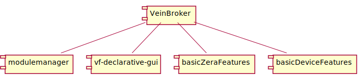

 10.12.2020 

# Separate Vein Broker and Modulemanager

The VeinBroker and modulemanger should be separated from each other like shown in the picture below.
It makes sense to put basic features in separate modules as well.

@startuml VeinNodes

[VeinBroker]
[modulemanager]
[vf-declarative-gui]
[basicZeraFeatures]

[VeinBroker] -- [modulemanager]
[VeinBroker] -- [vf-declarative-gui]
[VeinBroker] -- [basicZeraFeatures]
[VeinBroker] -- [basicDeviceFeatures]

@enduml

## VeinBroker

The VeinBroker combines The VeinEventHandler with the VeinNet::Networksystem, VeinNet::TcpSystem and 
VeinStorage::StorageHash. The application would start a VeinNet::TcpSystem server. All other applications
could connect to the tcpServer. Following this architecture communication and function are separated from each other and it is possible to connect further systems to vein without major impact on the whole system.
Issues in one participant would not affect the overall system functionality. 

We are already capable to connect to the broker with VeinNet. To simplify connecting to it, we should provide a vein Client library.

One issue is that VeinNet will only transmit local data. To Pass data from one client to another.
VeinNet marks all incoming data as foreign. It possible to adapt that behaviour to work around the problem.
It is to consider, that this would increase network traffic dramatic because all data coming from one clinet would also be transmitted back to it. VeinNet transmits only subscribed data over network though. unfortunately VeinNet provides only one subscription variable for all clients.

More details how to adapt vein are available [here](./NewVeinDesign.md).

## VeinClient

There is not much difference between the vein client library and the VeinBroker. The client library includes 
VeinNet. But instead of starting a server it offers the possibility to connect to a server. 
The client would not have a storage connected. With some further steps it would be possible to attach a storage to every vein node and improve efficiency quit a bit. 

## Separating System and Measurement Functions

The modulemanger combines static modules like customerdata and logger module with dynamic plug-in based modules. Therefore, adding a new faulty plug-in can crash even the most basic features. It makes sense to put all basic features into a separate node. One Step further would be to put basic device features like the StatusModule into another own node as well.

## Key Advantages

- easier and faster integration of new features
  - new features can be implemented encapsulated
  - debugging software is much easier because the modulemanager can run without a specific device.
- less testing 
  - The modules are less affected by each other and undetermined behaviour is less probable.
    A complete system test might not be necessary with all new features.
- higher robustness
  - The modules run in their own spaces. One failing module will not kill the complete application.