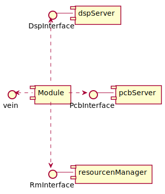
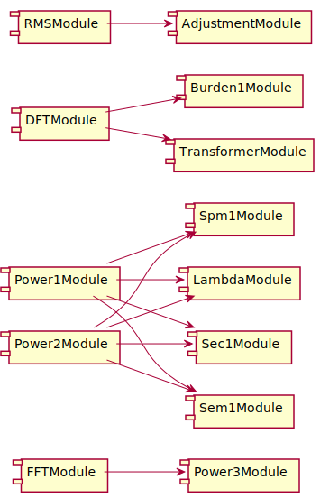

<div style="text-align: right"> 10.12.2020 </div>
# Measurement Modules

Measurement Modules take data from the dspServer and the pcbServer and 
do further computation with them.

Each module is configured with a XML file. Modules are designed to be usable
for a specified range of function and will based on the configuration compute 
one or more physical measurement channels. Depending on that each module can
have a different amount of vein components. The following documentation will describe the integration. Specific device configurations are documented in corresponding chapter under devices [here](../../../Zera/index.md).

Each module uses 3 Interfaces provided by the the dsp service, the pcb service and the resource manager service.
Using these the pcb and dsp interface they get measurement and status data, compute them and send the results further using the vein interface.

<div hidden>
@startuml genericModule

[Module]
DspInterface - [dspServer]
PcbInterface - [pcbServer]
RmInterface - [resourcenManager]

[Module] -u..> DspInterface
[Module] -r..> PcbInterface
[Module] -d..> RmInterface
[Module] -l..> vein

@enduml
</div>



To simplify communication with resourcemanager, dsp- and pcb-server each module depends on [zera-misc]().
To simplify the vein interface and the plugin interface each module is based on [zera-basemodule]().

## List

| Module                                         | Vein id range | Description                        |
| ---------------------------------------------- | ------------- | ---------------------------------- |
| [ModeModule](Documents/ModeModule.md) | 1000-1009     | init session measurement mode      |
| [RangeModule]()                                | 1020-1029     | Choose range, range automatic      |
| [SampleModule]()                               | 1030-1039     | sample switching and PLL automatic |
| [StatusModule]()                               | 1150          | device status                      |
| [SCPIModule]()                                 | 9999          | scpi interface                     |
| [RMSModule]()                                  | 1040-1049     | RMS measurement                    |
| [DFTModule]()                                  | 1050-1059     | DFT measurement                    |
| [FFTModule]()                                  | 1060-1069     | FFT measurement                    |
| [Power1Module]()                               | 1070-1079     | 3 phase power measurement          |
| [Power2Module]()                               | 1090-1099     | 3 phase power measurement only 4LW |
| [THDNModule]()                                 | 1010-1019     | THD noise measurement              |
| [OsciModule]()                                 | 1120-1129     | osci function with curve data      |
| [ReferenceModule]()                            | 1001          |                                    |
| [Power3Module]()                               | 1100-1109     |                                    |
| [Sec1Module]()                                 | 1130-1139     | meter test                         |
| [LambdaModule]()                               | 1140-1149     | lambda computation                 |
| [Burden1Module]()                              | 1160-1169     | Burden measurement                 |
| [Transformer1Module]()                         | 1170-1179     | Transformer measurement            |
| [EfficiencyModule]()                           | 1180-1189     | Power efficiency measurement       |
| [AdjustmentModule]()                           | 1190          | Adjust device                      |


Missing modules SEM and SPM coming soon!

## Dependencies


<div hidden>
```
@startuml measComp
left to right direction

[FFTModule] --> [Power3Module]
[Power1Module] --> [Sec1Module]
[Power2Module] --> [Sec1Module]
[Power1Module] --> [Sem1Module]
[Power2Module] --> [Sem1Module]
[Power1Module] --> [Spm1Module]
[Power2Module] --> [Spm1Module]
[Power1Module] --> [LambdaModule]
[Power2Module] --> [LambdaModule]
[DFTModule] --> [Burden1Module]
[DFTModule] --> [TransformerModule]
[RMSModule] --> [AdjustmentModule]

@enduml
```
</div>



Attention Sec1Module depends on Power1Module
or Power2Module and not both!


