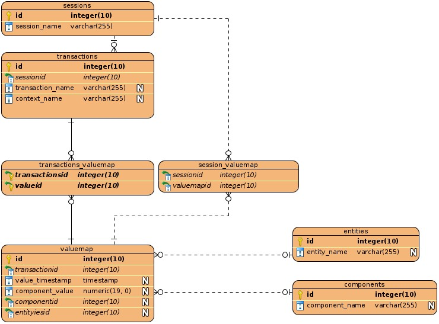

<div style="text-align: right"> 10.12.2020 </div>
# Database Documentation

The Vein database has a generic structure. Sessions are a set of related transactions.
In praxis that means, that each session is corresponding to one specific customer and 
measurement series.
Each transaction is either a snapshot or a recording. The actual data are stored in the
valuemap table. The relationship between data and transactions is shown in the transaction_valuemap
table. Each value is from a specific entity and component. The related entities and components 
are stored in the tables with the corresponding names. 
Furthermore each session has a set of static data. These are the customer data and the status data.
The static data are also stored in the valuemap table and connected to the session via the session_valuemap table.

The actual component values is stored in the component_value field inside the valuemap table.
This field is a Variant field and stores all kinds of data.

## Structure




## SQL Queries

To access the data in a usable format, here are some SQL queries that might help.
Please note some of these use variables you have to replace.
The variables are marked with ${}.

1. Get all sessions
```sql
SELECT session_name From sessions
```

2. Get static session data like customer and status data
```sql
SELECT valuemap.value_timestamp,valuemap.component_value, valuemap.id,
components.component_name, entities.entity_name,sessions.session_name
FROM sessions INNER JOIN sessions_valuemap ON 
sessions.id = sessions_valuemap.sessionsid 
INNER JOIN valuemap ON 
sessions_valuemap.valueid = valuemap.id 
INNER JOIN components ON 
valuemap.componentid = components.id 
INNER JOIN entities ON valuemap.entityiesid = entities.id 
where sessions.session_name = "${SessionName}"
```

3. Get all transactions mapped to a specific session
```sql
SELECT transaction_name From transactions JOIN sessions
ON sessionid=sessions.id Where session_name = "${Session}"
```

4. Get all data mapped to one transaction
```sql
SELECT valuemap.value_timestamp,valuemap.component_value, valuemap.id,
components.component_name, entities.entity_name,
transactions.transaction_name,sessions.session_name
FROM sessions INNER JOIN transactions ON
sessions.id = transactions.sessionid 
INNER JOIN transactions_valuemap ON 
transactions.id = transactions_valuemap.transactionsid 
INNER JOIN valuemap ON 
transactions_valuemap.valueid = valuemap.id 
INNER JOIN components ON 
valuemap.componentid = components.id 
INNER JOIN entities ON valuemap.entityiesid = entities.id 
where transactions.transaction_name = "§{transactionName}" AND 
sessions.session_name = "${SessionName}"
```

5. Get entity component relationship map
```sql
SELECT entity_name,component_name FROM valuemap JOIN entities 
ON entityiesid= entities.id JOIN components ON componentid=components.id
```


We recommend to use sqlite browser available [here](https://sqlitebrowser.org/).

## Elements

The Meaning of Modules and Components might vary depending on the  measurement session.
An overview is available [here](../../../Devices/Documents/session-db-overview.md).

