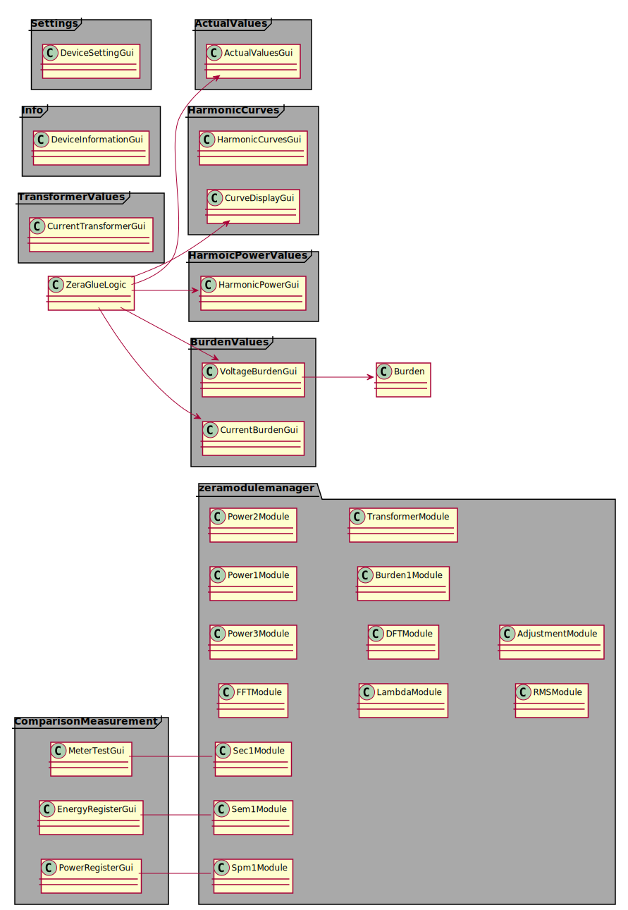

<div style="text-align: right"> 10.12.2020 </div>
# vf-declarative-gui

<div hidden>
```
@startuml guiComp
left to right direction
package "zeramodulemanager" {
class FFTModule
class Power3Module
class Power1Module
class Power2Module
class Power3Module
class LambdaModule
class LambdaModule
class DFTModule
class Burden1Module
class DFTModule
class TransformerModule
class RMSModule
class AdjustmentModule
class Sec1Module
class Sem1Module
class Spm1Module
}


class FFTModule
class Power1Module
class Power2Module
class Power3Module
class LambdaModule
class DFTModule
class Burden1Module 
class DFTModule
class TransformerModule
class RMSModule
class AdjustmentModule

frame "ActualValues"{
    class ActualValuesGui
}
frame "HarmonicCurves"{
    class HarmonicCurvesGui
    class CurveDisplayGui
}
frame "HarmoicPowerValues"{
    class HarmonicPowerGui
}
frame "ComparisonMeasurement"{
    class MeterTestGui
    class EnergyRegisterGui
    class PowerRegisterGui
}
frame "BurdenValues"{
    class VoltageBurdenGui
    class CurrentBurdenGui
}
frame "TransformerValues"{
    class CurrentTransformerGui
}
frame "Info" {
    class DeviceInformationGui
}
frame "Settings" {
    class "DeviceSettingGui"
}

ZeraGlueLogic-->ActualValuesGui
ZeraGlueLogic-->HarmonicPowerGui
ZeraGlueLogic-->CurrentBurdenGui
ZeraGlueLogic-->VoltageBurdenGui
ZeraGlueLogic-->CurveDisplayGui

MeterTestGui -- Sec1Module
EnergyRegisterGui -- Sem1Module
PowerRegisterGui -- Spm1Module

VoltageBurdenGui --> Burden

@enduml
```
</div>

<!---  --->