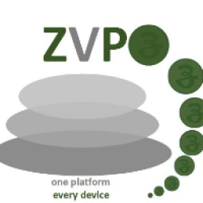
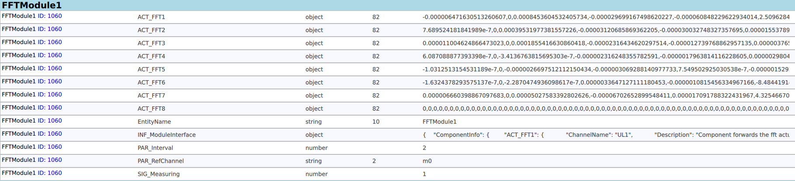
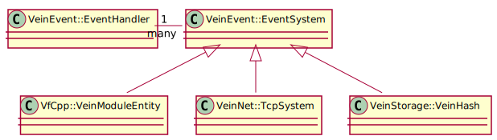
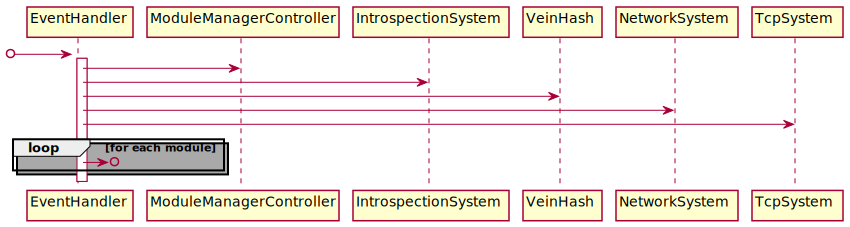
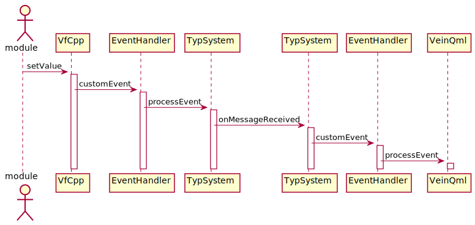

<div style="text-align: right"> 10.12.2020 </div>
# Vein Framework                   
------------------------------

## Introduction
The Vein Framework is Zera middleware. It provides Interprocess-communication over network.
It enables Zera to communicate inside a process and with other processes. 

### Basic Vein Architecture


Vein is based on Entities, Components and RPCs. A Entitie is compareable
with a class instance, while componants are like attributes and rpcs
are like methods.



The image above shows an example. FFTModule1 is the entity.
ACT_FFT1 is a component. On the right are the current component values. 

The following image shows a basic entity architecture.

<div hidden>
```
@startuml BasicVeinClass
VeinEvent::EventHandler "1" - "many" VeinEvent::EventSystem 
VeinEvent::EventSystem <|-- VfCpp::VeinModuleEntity
VeinEvent::EventSystem <|-- VeinNet::TcpSystem
VeinEvent::EventSystem <|-- VeinStorage::VeinHash
@enduml
```
</div>



Vein uses the qt custom event mechanism to 
publish data to Vein participants. To send new data sigSendEvent is called. 
The VeinEvent handler receives those and calls the processEvent function for all 
attached EventSystem based objects.

The order of the subsystems is important here. Some subsystems modify the object.
If that happens, the following object will not receive the original message anymore.
Modules can also accept messages. The following modules will not get any message in this case.
Manipulating or accepting messages is quite dangerous and should only be done very cautiousness. 
In best case only vein intern modules manipulate or accept messages.

The following subsystems do this kind of manipulation:
VeinNet::IntrospectionSystem
VeinNet::NetworkSystem
VeinNet::TcpSystem
 

Measurement modules should only react to messages with messages of their own.

<div hidden>
@startuml EventLoop

participant "EventHandler" as EH
participant "ModuleManagerController" as MC
participant "IntrospectionSystem" as VI
participant "VeinHash" as VS
participant "NetworkSystem" as VN
participant "TcpSystem" as VT


[o-> EH
activate EH
EH -> MC
EH -> VI
EH -> VS
EH -> VN
EH -> VT

loop for each module
    EH ->o?
end    

deactivate EH


@enduml
</div>


*This sequence is exactly equal to the current modulemanager*

If VeinNet is attached, a server is started and client connected,
VeinNet will process the data and transmit them to the connected VeinNet client.
The client will forward the message to the EventHandler it is attached to. 
The Eventhandler will distribute the Events to all attached participants.
The sequence is shown in the following diagram.


<div hidden>
@startuml BasicVeinSeq
actor module
participant "VfCpp"
participant "EventHandler" as E1
participant "TypSystem" as T1
participant "TypSystem" as T2
participant "EventHandler" as E2
participant "VeinQml"

module -> VfCpp: setValue
activate VfCpp
VfCpp -> E1: customEvent
activate E1
E1->T1: processEvent
activate T1
T1->T2: onMessageReceived
activate T2
T2->E2: customEvent
activate E2
E2->VeinQml: processEvent
activate VeinQml 

@enduml
```
</div>


You can find more information about qt custom events [here](https://doc.qt.io/qt-5/qobject.html#event).


## Vein subsystems

The preveous chapter covers the most basic communication sequence between two subsystem in two different vien nodes. A node is a collection of vein subsystem connected to each other using the VeinEvent::EventHandler.

Further important subsystems are VeinStorage::VeinHash, VeinNet::Introspectionsystem and VeinApiQml::VeinQml.

### VeinStorage::VeinHash

## Constraints

- Only one process can offer components and entites right now.
- vf-qml can not add entities or components.
- It is not possible to delete entities in vf-qml. That does not mean, that it is not possible to delete entities once accessed with vf-qml.
- The order of modules added to the VeinEvent::EventHandler has heavy impact on the function or malfuncntion of the system. 

## Further information
- [Further documentation and new vein design](../Documents/NewVeinDesign.md)
- [vf-declarative-gui](Documents/vfdecgui.md)  // Does not belong here

