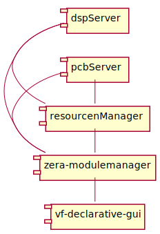

<div style="text-align: right"> 10.12.2020 </div>
# ZeraVeinPlatform

ZeraVeinPlatform describes the complete software stack used in all our new devices.
It includes basically a framework which provides interprocess communication based and 
developed for Qt applications as well as a set of common measurement and GUI modules.
To implement those on an embedded device we are using openEmbedded.

## Introduction

The basic software architecture uses 5 components.
The pcbServer and dspServer are the connection to the devices hardware
and realtime computation. They abstract all hardware resources and 
transmit all measurement data to measurement modules embedded into 
the zera-modulemanager. The measurement modules allocate the 
resources based on the data provided by the resourcemanager.
Most modules are plugins and can be replaced using different 
session configurations. The measurement modules do further computation and 
publish data into Vein. The zera-modulemanager is also the Vein broker and 
uses VeinNet to transmit data to all connected clients like the vf-declarative-gui. 


<div hidden>
```
@startuml BasicVeinComponents
left to right direction
[dspServer] - [zera-modulemanager]
[pcbServer] - [zera-modulemanager]
[dspServer] - [resourcenManager]
[pcbServer] - [resourcenManager]
[resourcenManager] - [zera-modulemanager]
[zera-modulemanager] - [vf-declarative-gui]
@enduml
```

</div>




## [Vein Framework](./VeinFramework/index.md) 

The Vein Framework in basically a middleware offering interprocess communication over network as
well as a set of basic vein participants offering important and useful features.

For more information click [here](./VeinFramework/)

## [Zera Modulemanager](Documents/Modulemanager.md)

Each measurement module is a plug-in loaded by the modulemanager.
Which plug-ins to load and which configuration to use is defined inside the
modulemanager configuration.

For more information click [here](Documents/Modulemanager.md).

## [Measurement Modules](MeasurementModules/index.md)

The measurement modules compute precomputed data provided by the hardware and/or 
distribute them inside the Vein Framework

For more information click [here](./MeasurementModules/).

## [Hardware Abstraction](Hardwareabstraction/index.md)

The hardware abstraction is based on three components. The dspModule, pcbServer and the resource-manager.
The dpsModule communicates with the DSP embedded in all zera devices. The pcbServer communicates with the 
device specific hardware. The resource-manager maintains a list off all available hardware resources and 
provides them to the measurement modules.

## OpenEmbedded

OpenEmbedded is a build framework to build embedded Linux.
It is based on layers. Each layer provides a specific set of features.
To implement the components above zera uses the layer meta-zera.
This is a private layer. It depends on software only accessible 
for Zera employee like all our firmware. 

We do that because we do not want to provide software for our specific solution.
But who is interested can implement the Vein Framework in their own applications.

The minimum layer structure we are using is:

- [bitbake](https://github.com/openembedded/bitbake)
- [openembedded-core](https://github.com/openembedded/openembedded-core)
- [meta-openembedded](https://github.com/openembedded/meta-openembedded)
- [meta-mortsgna](https://github.com/schnitzeltony/meta-mortsgna)
- [meta-qt5](https://github.com/meta-qt5/meta-qt5)
- [meta-qt5-extra](https://github.com/schnitzeltony/meta-qt5-extra)
- [meta-python2](https://git.openembedded.org/meta-python2)

Device specific:

- [meta-freescale](https://github.com/Freescale/meta-freescale)
- [meta-freescale-3rdparty](https://github.com/Freescale/meta-freescale-3rdparty)

Zera specific:

- meta-zera

## [Future Aspects](FutureAspects/index.md)

For more information click [here](FutureAspects/index.md).


## Further Information

- [Logger Database](VeinFramework/Documents/Database.md) \\
  Information how snapshots and recordings are stored and how to access those data.
- [repositories](Documents/repos.md) \\
  A List with all important Zera repositories.